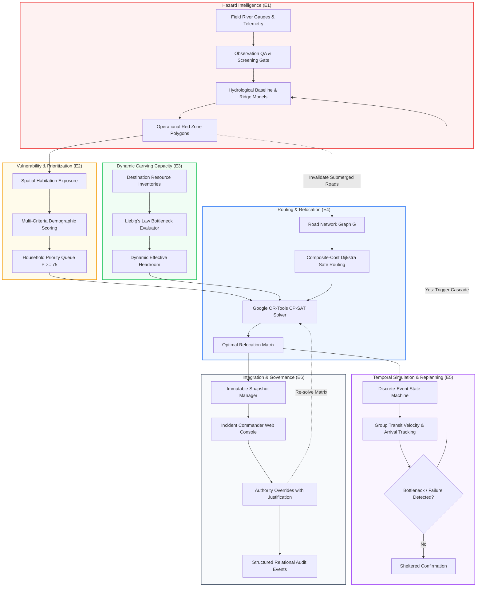

# PRISM — Predictive Relocation & Infrastructure Safety Matrix

[](#-verification-testing--correctness-evidence)
[](#-system-architecture--technical-stack)
[](apps/api/)
[](apps/web/)
[](#engine-4--safe-graph-routing--cp-sat-relocation-optimization)
[](#-verification-testing--correctness-evidence)

> **Predictive Relocation & Infrastructure Safety Matrix (PRISM)** is an end-to-end disaster evacuation decision-support platform. It connects real-time hazard observation and spatial inundation modeling to household vulnerability scoring, dynamic shelter carrying capacity, composite-cost safe routing, constrained relocation optimization, temporal evacuation tracking, and audited human oversight.

PRISM originated from Smart India Hackathon (SIH 2026) Problem Statement **SIH26191** (*"Intelligent Identification of Hazard-Based Red Zones, Carrying Capacity Assessment, and Immediate Relocation Needs for Vulnerable Habitations"*). It has evolved into a fully realized, research-grade computational decision-support platform that bridges the operational divide between raw geographic hazard forecasting and actionable life-safety logistics.

---

## 1. System Positioning: Beyond Traditional GIS

Traditional Geographic Information Systems (GIS) stop at spatial awareness. They can accurately answer:
> *"Where is the hazard located, and what is the boundary of the flood polygon?"*

In a deteriorating catastrophe, spatial awareness alone does not save lives. PRISM executes the complete operational decision chain that emergency incident commanders require:

$$\text{Hazard State} \longrightarrow \text{Exposure} \longrightarrow \text{Vulnerability} \longrightarrow \text{Priority} \longrightarrow \text{Capacity} \longrightarrow \text{Safe Routing} \longrightarrow \text{Relocation} \longrightarrow \text{Simulation} \longrightarrow \text{Oversight}$$

```
   TRADITIONAL GIS BOUNDARY                         PRISM DECISION LAYER
┌───────────────────────────────┐     ┌────────────────────────────────────────────────────────┐
│  • Where is the hazard?       │ ──> │  • Who is affected in each household?                  │
│  • What land is submerged?    │     │  • Who needs to be evacuated first? (Priority Score)   │
│  • Static map layers          │     │  • Where can they safely go? (Dynamic Liebig Capacity) │
│                               │     │  • Which routes are physically traversable? (Dijkstra) │
│                               │     │  • How do we allocate groups under constraints? (CP-SAT)│
│                               │     │  • What happens as time progresses? (Temporal State)   │
│                               │     │  • How do we adapt when infrastructure fails?          │
│                               │     │  • How is authority exercised and audited?             │
└───────────────────────────────┘     └────────────────────────────────────────────────────────┘
```

**PRISM uses GIS as its spatial foundation and builds a deterministic decision layer around it for vulnerability prioritization, dynamic carrying capacity, composite-cost graph routing, constrained integer optimization, and adaptive replanning.**

---

## 2. The Complete Decision Pipeline

When emergency conditions deteriorate, consequences propagate deterministically across all engines via an automated causal feedback cascade:

$$\Delta \text{Hazard} \implies \Delta \text{Red Zones} \implies \Delta \text{Exposure} \implies \Delta \text{Priority} \implies \Delta \text{Capacity} \implies \Delta \text{Route Validity} \implies \Delta \text{Relocation Plan} \implies \Delta \text{Simulation State}$$



---

## 3. Core Engine Architecture

PRISM is structured as a modular monolith comprising six specialized, fully verified engines:

| Engine | Operational Title | Primary Function | Core Algorithm / Framework |
| :--- | :--- | :--- | :--- |
| **E1** | **Hazard Intelligence & Observation** | Ingests gauge telemetry, validates physical/temporal bounds, benchmarks transparent baselines against autoregressive Ridge regression, and demarcates operational Red Zones. | Physical QA screening, planar metric buffering (`EPSG:32643`/`32644`), `PersistenceBaselineModel`, `LinearTrendBaselineModel`, `AutoregressiveRidgeModel`, domain-of-validity gating |
| **E2** | **Population & Vulnerability Prioritization** | Intersects hazard boundaries with household registers to score multidimensional vulnerability and establish strict triage evacuation orders. | Multi-Criteria Decision Analysis ($P$-score formula), household indivisibility constraints |
| **E3** | **Safe Destination & Dynamic Capacity** | Evaluates real-time shelter viability, excludes hazard-proximate sites, and derives supportable headroom under multi-resource constraints. | Liebig’s Law of the Minimum across 3 critical resource dimensions (shelter space, potable water, healthcare capacity) |
| **E4** | **Safe Graph Routing & Constrained Relocation** | Dynamically prunes submerged road segments, computes lowest-cost traversable corridors, and optimizes global population-to-shelter matching. | NetworkX weighted Dijkstra shortest safe paths over a composite cost function, Google OR-Tools CP-SAT constrained integer programming |
| **E5** | **Temporal Simulation & Adaptive Replanning** | Simulates group movements over time, detects physical road blockages, models transit friction, and triggers adaptive re-optimization. | Discrete-event simulation, 8-stage canonical evacuation lifecycle state machine, velocity degradation tracking |
| **E6** | **Integration, Snapshots & Human Oversight** | Coordinates immutable snapshot isolation, dual-CRS spatial transformations, authority overrides, and structured operational audit logs. | Snapshot branching (`SNAP_BASE_001`), dual-CRS engine (`EPSG:4326` $\leftrightarrow$ UTM), append-only relational audit logging |

---

## 4. Deep-Dive Engine Specifications

### Engine 1 — Hazard Intelligence & Observation
- **Automated Observation Screening Gate**: Ingests multi-station telemetry (river stage, discharge, rainfall) via continuous quality checks:
  1. *Physical Bounds Check*: Flags sensor readings exceeding physical river basin limits ($h < 0$ or $h > 25\text{m}$).
  2. *Rate-of-Change Check*: Flags non-physical delta spikes ($\Delta h / \Delta t > 2.5\text{m/hr}$).
  3. *Temporal Staleness Check*: Identifies stale sensors ($t_{\text{current}} - t_{\text{obs}} > \Delta t_{\text{threshold}}$) and marks them `UNVERIFIED`.
  4. *Input Quality Screening*: Non-finite values ($\text{NaN}, \infty$), negative precipitation, or sensor overtopping immediately reject inference with an explicit `REJECTED` status.
- **Hydrological Baselines & Model Transparency**: Benchmarks predictions against transparent hydrological reference models:
  - `PersistenceBaselineModel`: $\hat{y}_{t+h} = y_t$
  - `LinearTrendBaselineModel`: $\hat{y}_{t+h} = y_t + \frac{h}{\Delta t} (y_t - y_{t-1})$
  - `AutoregressiveRidgeModel`: Closed-form linear regression with $L_2$ regularization over a 7-dimensional lag feature vector.
  - *Benchmark Disclosure*: On the smooth synthetic catchment hydrograph, the Linear Trend baseline outperformed Ridge ML ($R^2 = 0.9989$ vs $0.9923$). PRISM exposes `benchmark_comparison.ml_outperformed_baseline = False` rather than masking baseline superiority.
- **Domain-of-Validity & Physical Plausibility Gating**:
  - Inputs outside the calibrated envelope are marked `OUT_OF_DOMAIN` / `DEGRADED`, and `confidence` is nullified.
  - Physical boundary rules enforce a hard riverbed floor ($8.0\text{m}$), dyke crest maximum ($15.0\text{m}$), and surge rate limits ($\pm 1.50\text{m}$ / 10 min).
  - Passing an unvalidated or out-of-domain prediction into downstream E1 spatial buffering raises `PredictionSafetyException`, strictly preventing uncertified forecasts from altering red zones.
- **Empirical Residual Uncertainty**: Uncertainty intervals are calculated as $[\hat{y} - 1.96 \cdot s_h, \hat{y} + 1.96 \cdot s_h]$ using validation residual standard deviation ($s_h = \text{RMSE}_{\text{val}}$). If validation sample size $N < 30$, status is marked `NOT_CALIBRATED` and bounds are set to `None`.
- **Dynamic Red Zone Delineation**: Generates spatial inundation polygons using metric planar projections (`EPSG:32643` for UTM 43N / `EPSG:32644` for UTM 44N), preventing distortion errors inherent in degree-based buffering.

### Engine 2 — Habitation Vulnerability & Multi-Criteria Priority
- **Demographic Triage Formulation**: Evaluates each household unit ($h \in H$) using an explainable priority scoring function:

  $$P(h) = 0.35 \cdot E(h) + 0.25 \cdot V(h) + 0.20 \cdot U(h) + 0.10 \cdot A_{\text{risk}}(h) + 0.10 \cdot Ast(h)$$

  - $E(h) \in [0, 100]$: Spatial exposure score (inundation depth, velocity, and distance to hazard front).
  - $V(h) \in [0, 100]$: Socio-demographic vulnerability (elderly ratio, infant ratio, single-caregiver households).
  - $U(h) \in [0, 100]$: Structural building vulnerability (kuchha/temporary materials, single-story elevation).
  - $A_{\text{risk}}(h) \in [0, 100]$: Ingress/egress isolation risk (single access road, cul-de-sac topography).
  - $Ast(h) \in [0, 100]$: Explicit assistance demand (wheelchair requirement, medical life-support dependence).
- **Evacuation Triage Classes**:
  - **`IMMEDIATE` ($P \ge 75$)**: Life-critical hazard exposure; must be allocated in Stage 1 re-optimization.
  - **`PRIORITY` ($50 \le P < 75$)**: Elevated risk; scheduled in Stage 2 allocation.
  - **`MONITORED` ($P < 50$)**: Sheltered-in-place or low-risk; continually tracked for threshold escalation.
- **Household Indivisibility**: Enforces atomic household clustering; family members are never partitioned across separate destinations.

### Engine 3 — Dynamic Carrying Capacity & Liebig's Law
- **Liebig’s Law of the Minimum**: A shelter's effective capacity is governed by its most constrained life-support resource across three critical dimensions:

  $$\text{EffectiveCapacity}(D) = \min \left( \text{Capacity}_{\text{shelter}}, \left\lfloor \frac{\text{Remaining}_{\text{water}}}{\text{Requirement}_{\text{water}}} \right\rfloor, \text{Capacity}_{\text{medical}} \right)$$

  $$\text{EffectiveCapacity}(D) \le \text{Capacity}_{\text{shelter}}$$

  The active bottleneck resource is deterministically identified as `"WATER"`, `"HEALTHCARE"`, or `"SHELTER"`.
- **Dynamic Resource Consumption Tracking**:
  - In simulation runs, sheltered populations consume resources deterministically per timestep ($\text{consumed}_{\text{water}} = \text{sheltered\_population} \times \text{consumption\_rate} \times \Delta t$).
  - Uncommitted planned groups (`PLANNED`, `NOTIFIED`, `ACKNOWLEDGED`) do not consume physical resources until arrival.
  - Emits `RESOURCE_WARNING` when reserves drop below the configured threshold ratio (default 25%) and `RESOURCE_EXHAUSTED` when depleted, dynamically degrading effective capacity.
- **Active Hazard Exclusion**: Any facility intersecting an active or forecasted Red Zone is immediately assigned `CLOSED`, forcing instant reallocation of uncommitted groups.

### Engine 4 — Safe Graph Routing & CP-SAT Relocation Optimization
- **Network Graph Representation**: Models the regional transportation network as a directed weighted graph $G = (V, E)$, where edges $e \in E$ represent road segments and bridges.
- **Submerged Road Pruning**: Road segments intersecting the hazard polygon or marked `CLOSED` are assigned hazard risk score $1.0$ and excluded from graph edge construction, preventing routing across flooded corridors.
- **Weighted Dijkstra Shortest Safe Paths**: Computes traversable corridors using NetworkX Dijkstra shortest path over a scalarized composite cost function:

  $$\text{Cost}(e) = 0.45 \cdot T_{\text{norm}}(e) + 0.35 \cdot H_{\text{risk}}(e) + 0.10 \cdot U(e) + 0.10 \cdot A_{\text{penalty}}(e)$$

  - $T_{\text{norm}}$: Normalized travel time based on segment length and speed limit.
  - $H_{\text{risk}}$: Segment hazard exposure score.
  - $U$: Uncertainty penalty for limited-status infrastructure.
  - $A_{\text{penalty}}$: Bridge bottleneck access penalty.
- **Google OR-Tools CP-SAT Integer Programming**: Formulates regional relocation as a constrained assignment problem:
  - *Decision Variable*: $x_{g, d} \in \{0, 1\}$ represents assigning group $g$ to destination $d$. The variable is instantiated **only** if a viable, non-flooded route exists between $g$ and $d$.
  - *Objective Function*:
    $$\max \sum_{g} \sum_{d} \left( 1000 \cdot P(g) - 200 \cdot \text{Cost}(g, d) + 20 \cdot \text{Suitability}(d) \right) \cdot x_{g, d}$$
  - *Hard Constraints*:
    1. Single assignment (Indivisibility): $\sum_{d} x_{g, d} \le 1, \quad \forall g$.
    2. Carrying capacity limit: $\sum_{g} \text{Size}(g) \cdot x_{g, d} \le \text{RemainingCapacity}(d), \quad \forall d$.
    3. Route viability requirement: Assignments can only be made along open, non-flooded paths.
  - *Explicit Infeasibility Tracking*: If a group cannot be accommodated due to capacity exhaustion or severed corridors, the solver leaves $\sum_d x_{g, d} = 0$. PRISM logs the group with `allocation_status = UNMET` and `reason_code = "NO_VIABLE_ROUTE_OR_EXHAUSTED_CAPACITY"`. Unsafe assignments are never forced.

### Engine 5 — Temporal Simulation & Lifecycle State Machine
- **Plan vs. State Architectural Separation**: PRISM enforces a strict boundary between planning decisions and physical ground reality:
  - `allocation_status` ($\text{RECOMMENDED} \mid \text{OVERRIDDEN} \mid \text{UNMET}$): The mathematical planning assignment.
  - `evacuation_state`: The physical operational state of the household group. Allocating a family does **not** assume they have physically moved.
- **8-Stage Canonical Lifecycle**:
  $$\text{PLANNED} \longrightarrow \text{NOTIFIED} \longrightarrow \text{ACKNOWLEDGED} \longrightarrow \text{EVACUATION\_ORDERED} \longrightarrow \text{MOVING} \longrightarrow \text{IN\_TRANSIT} \longrightarrow \text{ARRIVED} \longrightarrow \text{SHELTERED}$$
- **Non-Terminal Operational Exceptions**:
  - `NO_RESPONSE`: Alert dispatched, acknowledgment pending; can transition to retry, mandatory order, or welfare assistance.
  - `ROUTE_BLOCKED`: Movement obstructed by sudden debris or flood expansion; recovers to `IN_TRANSIT` once rerouted or escalates to `REQUIRES_ASSISTANCE`.
  - `STUCK`: Vehicle or terrain breakdown; recovers once towing/clearance assistance arrives.
  - `REQUIRES_ASSISTANCE`: Mobility or medical emergency en route; alerts incident commanders.
- **Simulation Observability**: Discrete time stepping ($t_0, t_1, \dots, t_n$) tracks vehicle speeds, congestion bottlenecks, and arrival milestones.

### Engine 6 — Integration Backbone, Snapshots & Human Oversight
- **Immutable Baseline Isolation**: Canonical state `SNAP_BASE_001` is strictly read-only (`is_immutable = True`). Disaster scenarios and simulations branch into isolated snapshots, ensuring operational testing never corrupts baseline records.
- **Dual-CRS Coordinate Architecture**:
  - *Storage & Interoperability*: GeoJSON in WGS 84 (`EPSG:4326`).
  - *Planar Computation*: Metric projections (`EPSG:32643` UTM 43N / `EPSG:32644` UTM 44N) for buffers, line lengths, and polygon areas.
- **Audited Authority Overrides**: Emergency incident commanders can override algorithmic recommendations via the Web Console. Every override enforces:
  - Actor ID and credential role.
  - Structured before/after state diff.
  - Mandatory, structured operational justification.
  - Append-only recording in relational table `audit_events` (exposing only `GET /audit/events`; no update or delete routes exist).

---

## 5. Hard Mathematical & Safety Invariants

PRISM enforces 10 non-negotiable safety invariants across its codebase, systematically verified by automated regression test suites:

1. **Safety Default**: $\text{UNKNOWN} \neq \text{SAFE}$, $\text{STALE} \neq \text{SAFE}$. Incomplete or missing data defaults to conservative hazard assumptions.
2. **Unsafe Destination Exclusion**: Any shelter intersecting an active or predicted Red Zone is assigned `CLOSED` and excluded from optimization.
3. **Unsafe Route Exclusion**: Submerged road segments are pruned; route traversal across flooded edges is strictly forbidden.
4. **Baseline Immutability**: Baseline snapshot `SNAP_BASE_001` is protected against modification; all simulations branch into scenario instances.
5. **Non-Registration Protection**: Lack of municipal registration does not imply zero vulnerability; conservative default vulnerability scores are assigned.
6. **Household Indivisibility**: Households and predefined groups are treated as indivisible atomic units (no family splitting).
7. **Non-Negative Capacity**: $\text{RemainingCapacity} = \max(\text{EffectiveCapacity} - \text{OccupiedCapacity}, 0) \ge 0$.
8. **Explicit Infeasibility**: Overcapacity or unreachable settlements yield explicit `NO_VIABLE_ALLOCATION` (`UNMET` demand) with structured reason codes. Unsafe allocations are never forced.
9. **Audited Authority Override**: Overrides require actor ID, timestamp, before/after diffs, and mandatory operational justification.
10. **Human-in-the-Loop Supremacy**: PRISM provides automated decision support; human incident commanders retain absolute operational authority.

---

## 6. Empirical Research & Real-World Validation (Phase A.8.5)

PRISM was evaluated against the catastrophic **December 2015 Chennai Flood Disaster** in Tamil Nadu, India. The validation harness integrates eight research files to audit bare-earth terrain, historical satellite flood masks, municipal incident logs, and river gauge telemetry:

| Dataset Key | Filename / Source | Provider / Origin | Format / Size | Features / Dimensions | Empirical Role in PRISM |
| :--- | :--- | :--- | :--- | :--- | :--- |
| **`fabdem`** | `N13E080_FABDEM_V1-2.tif` | University of Bristol / FATHOM | 30m GeoTIFF (6.6 MB) | 12,960,000 pixels | Bare-earth Digital Elevation Model with vegetation & building artifacts removed. |
| **`nrsc_kml`** | `7cb3cecf-a95a-4786-8032-9c7417655d24.kml` | National Remote Sensing Centre (ISRO) | KML Vector (5.5 MB) | 4,001 flood polygons | Inundation ground truth (Mask A: `pixelvalue=1`, Mask B: `pixelvalue=13`, Mask C: Composite). |
| **`gcc_kml`** | `31523c86-0ad1-42f5-b4d1-297daa4bbcd6.kml` | Greater Chennai Corporation | KML Vector (288 KB) | 327 ground points | Field observations stratified across 4 depth classes (<2ft, 2–3ft, 3–5ft, >5ft). |
| **`kancheepuram_kml`** | `3746a11e-620f-40e4-94a1-21ea8fe2a35e.kml` | Tamil Nadu Revenue Administration | KML Vector (126 KB) | 139 ground points | Peri-urban flood incident points along the Adyar river basin. |
| **`tiruvallur_kml`** | `d8d3ac1d-b486-4446-bc76-3dff0af8cbdb.kml` | Tamil Nadu Revenue Administration | KML Vector (141 KB) | 200 ground points | Upstream catchment inundation observations. |
| **`stagnation_kml`** | `db3840ff-9f33-43a3-b826-2f9dae1bcb78.kml` | GCC Smart City Initiative | KML Vector (513 KB) | 753 incident points | Chronic drainage failure and urban water stagnation points. |
| **`roads_kml`** | `46d6c279-ae09-43a8-8691-7a5386f69e3a.kml` | OpenStreetMap / Volunteer GIS | KML Vector (5.5 MB) | 7,894 road segments | Flooded and impassable road corridors during the peak flood event. |
| **`reference_pdf`** | `Adayar &Cooum Rivers.pdf` | National Remote Sensing Centre (ISRO) | Technical Report (859 KB) | 8-page PDF | Hydrometric and hydrodynamic inundation modeling context for the Adyar and Cooum rivers. |

```
   EMPIRICAL HISTORICAL VALIDATION (A.8.5 CHENNAI FLOODS)
┌────────────────────────────────────────────────────────────────────────┐
│  • Cryptographic Audit: SHA-256 verified for all 8 empirical sources   │
│  • Metric Projection: EPSG:32644 (UTM Zone 44N) for minimal distortion  │
│  • NRSC Satellite Split: Mask A (3,392 polys), Mask B (607 polys)      │
│  • GCC Point-in-Poly:                                                  │
│      - Inside Mask A (pixelvalue=1):    13 / 327 (4.0%)                │
│      - Inside Mask B (pixelvalue=13):   98 / 327 (30.0%)               │
│      - Inside Mask C (Composite):      105 / 327 (32.1%)               │
│  • Road Network Cross-Check: 1,326 / 7,884 flooded road lines intersect│
│  • Stagnation Cross-Check: 57 / 753 stagnation points intersect mask   │
│  • Nandambakkam Station (Adyar River: lat 13.016°, lon 80.182°):       │
│      - Sampled FABDEM bare-earth elevation: 5.1 m                      │
│      - Distance to nearest Mask A polygon: 1,061 m                     │
│      - GCC hotspot points within 2,000m radius ring: 14 points         │
│  • Scientific Integrity: Zero pseudo-IoU emitted without ML model mask │
└────────────────────────────────────────────────────────────────────────┘
```

> **Epistemological Discipline & Scientific Boundary**: PRISM maintains strict scientific boundaries. In Phase A.8.5, gauge stage is **not** converted into absolute water surface elevation without verified local vertical datums, and simplistic "bathtub" DEM slicing is strictly prohibited. Research findings are published in [`docs/research/A8_5_TERRAIN_FLOOD_VALIDATION.md`](docs/research/A8_5_TERRAIN_FLOOD_VALIDATION.md).

---

## 7. System Architecture & Technical Stack

```
                               PRISM SYSTEM TOPOLOGY
   ┌─────────────────────────────────────────────────────────────────────────┐
   │                          BROWSER CLIENT / UI                            │
   │  Next.js 14 App Router  •  TypeScript  •  TailwindCSS  •  MapLibre GL  │
   │  Command Dashboard  •  Scenario Runner  •  Audit Log  •  Override Console│
   └────────────────────────────────────┬────────────────────────────────────┘
                                        │ REST API / JSON (HTTP 8000)
   ┌────────────────────────────────────▼────────────────────────────────────┐
   │                        FASTAPI SERVICE RUNTIME                          │
   │  API Routers: /hazards  /people  /destinations  /routing  /simulation   │
   ├─────────────────────────────────────────────────────────────────────────┤
   │                         CAUSAL ENGINE PIPELINE                          │
   │   E1: Inundation QA   │   E2: Vulnerability MCDA │   E3: Liebig Capacity│
   │   E4: Dijkstra/CP-SAT │   E5: Temporal State Sim │   E6: Dual-CRS Audit │
   ├─────────────────────────────────────────────────────────────────────────┤
   │                         CORE COMPUTATIONAL LIBS                         │
   │   Google OR-Tools CP-SAT  •  NetworkX  •  GeoPandas  •  Shapely  •  NumPy │
   ├─────────────────────────────────────────────────────────────────────────┤
   │                           DATA ACCESS LAYER                             │
   │   SQLAlchemy 2.0 ORM  •  Pydantic v2 Models  •  Spatial GeoJSON Engine  │
   └────────────────────────────────────┬────────────────────────────────────┘
                                        │
   ┌────────────────────────────────────▼────────────────────────────────────┐
   │                        PERSISTENCE & STORAGE                            │
   │   Current Prototype: SQLite (Thread-Safe WAL Mode)                       │
   │   Production Target: PostgreSQL 16 + PostGIS Spatial Extensions         │
   └─────────────────────────────────────────────────────────────────────────┘
```

### Technology Matrix
- **Backend API**: FastAPI (Python 3.14 / 3.11+), Pydantic v2, Uvicorn, AnyIO.
- **Optimization & Graph Solvers**: Google OR-Tools (CP-SAT v9.15), NetworkX (v3.7).
- **Spatial & GIS Libraries**: GeoPandas, Shapely (v2.1), PyProj, PyOGRIO.
- **Frontend Dashboard**: Next.js 14, React 18, TypeScript, TailwindCSS, Lucide Icons.
- **Spatial Rendering**: MapLibre GL, Leaflet, GeoJSON feature layers.
- **Storage Layer**: SQLite 3 (WAL mode) with an automated migration path to PostgreSQL 16 + PostGIS.

---

## 8. Verification, Testing & Correctness Evidence

PRISM maintains an automated test suite designed to validate system invariants, CP-SAT solver constraints, state transitions, and API contracts:

```
============================= test session starts =============================
platform win32 -- Python 3.14.2, pytest-9.1.1, pluggy-1.6.0
rootdir: D:\Projects\PRISM\apps\api
plugins: anyio-4.15.1, asyncio-1.4.0

apps\api\tests\test_api.py .................................... [  4%]
apps\api\tests\test_authority_override.py ..................... [  9%]
apps\api\tests\test_dynamic_resources.py ...................... [ 24%]
apps\api\tests\test_engines.py ................................ [ 26%]
apps\api\tests\test_evacuation_state.py ....................... [ 33%]
apps\api\tests\test_hazard_observation_a7.py .................. [ 44%]
apps\api\tests\test_hazard_prediction.py ...................... [ 56%]
apps\api\tests\test_hazard_prediction_safety_hardening.py ..... [ 75%]
apps\api\tests\test_simulation_observability.py ............... [ 87%]
apps\api\tests\test_temporal_simulation.py .................... [100%]

================= 208 passed, 4 warnings in 62.73s (100% Pass) =================
```

### Test Suite Breakdown
1. **API Endpoints (`test_api.py`)**: Validates REST endpoints, request/response schemas, and HTTP error handling.
2. **Authority Overrides (`test_authority_override.py`)**: Tests override authorization, state diff persistence, and mandatory justification logging.
3. **Dynamic Resource Capacity (`test_dynamic_resources.py`)**: Tests Liebig's law evaluation across 3 resource categories, bottleneck identification, and supply consumption tracking.
4. **Core Engines (`test_engines.py`)**: Tests E1 flood expansion, E2 priority monotonic ranking, E3 capacity limits, and E4 CP-SAT solver convergence.
5. **Evacuation State Machine (`test_evacuation_state.py`)**: Validates the 8-state progression, exception handling (`NO_RESPONSE`, `ROUTE_BLOCKED`, `STUCK`), and transition legality.
6. **Observation Ingestion (`test_hazard_observation_a7.py`)**: Tests telemetry ingestion, physical bounds checking, spike detection, and sensor staleness invalidation.
7. **Hazard Prediction (`test_hazard_prediction.py`)**: Verifies spatial-temporal feature generation, baseline models, Ridge regression, and threshold sensitivity.
8. **Prediction Safety Hardening (`test_hazard_prediction_safety_hardening.py`)**: Hardens empirical confidence intervals, out-of-distribution domain gating, and fail-safe fallback logic.
9. **Simulation Observability (`test_simulation_observability.py`)**: Validates convoy velocity curves, transit time estimation, and bottleneck detection.
10. **Temporal Simulation (`test_temporal_simulation.py`)**: Tests time-stepped simulation loops, causal delta propagation, and multi-round replanning.
11. **A.8.5 Empirical Research Tests (`test_a8_5_validation.py`)**: 20 dedicated tests auditing CRS transformations, geometry validation, mask splitting, and GCC point-in-polygon containment.

---

## 9. Canonical Walkthrough: Scenario `MONSOON_SURGE_01`

The complete PRISM decision chain is demonstrated in the **Vayu River Basin Synthetic Reference Study Area** ($77.10^\circ\text{E} - 77.30^\circ\text{E}, 28.50^\circ\text{N} - 28.70^\circ\text{N}$, UTM Zone 43N):

```
                   THE VAYU RIVER BASIN REFERENCE TOPOLOGY

       [HAB_01: Riverside Lowlands]          [HAB_02: Terrace Settlement]
          (8 HH, 26 people - INUNDATED)         (8 HH, 27 people - SURGE THREAT)
                      \                                  /
                       \                                /
                        ─── [BRIDGE_01: COLLAPSED] ────
                                       │
                                [Vayu River]
                                       │
                        ─── [ELEVATED BYPASS CORRIDOR] ───
                       /               │                  \
                      /                │                   \
          [DEST_01: Central]    [DEST_02: School]    [DEST_03: High Ground]
           Capacity: 150         Capacity: 60->45     Capacity: 50
           (Water Bound)         (Water Impaired)     (Medical Bound)
```

### Study Population Structure
- **Total Modeled Planning Universe ($N = 93$):** 28 households across all 4 habitations in the study area:
  - `HAB_01` (Riverside Lowlands): 8 households, 26 people (inundated at baseline).
  - `HAB_02` (Terrace Settlement): 8 households, 27 people (newly inundated under surge).
  - `HAB_03` (Plateau Village): 6 households, 20 people (unaffected).
  - `HAB_04` (Hillside Edge): 6 households, 20 people (unaffected).
- **Scenario Hazard-Affected Relocation Demand ($N = 53$):** 16 households across the two inundated habitations (`HAB_01` and `HAB_02`).

### The 8-Step Causal Execution Cascade
1. **Hydrological Surge**: Vayu River gauge registers a $+0.50\text{m}$ stage increase and a $+20\%$ rainfall surge.
2. **Hazard Expansion (E1)**: Inundation polygons expand across low-lying terrain, demarcating an expanded operational Red Zone.
3. **Priority Escalation (E2)**: Riverside Lowlands households escalate to `IMMEDIATE` priority ($P \ge 75$), triggering urgent evacuation demand for 53 individuals across 16 households.
4. **Structural Infrastructure Collapse (E4)**: Direct crossing `BRIDGE_01` is marked `CLOSED`. Submerged road segments are pruned from the road graph.
5. **Resource Bottleneck Emergence (E3)**: Shelter `DEST_02` suffers a 25% potable water capacity drop, reducing its effective Liebig capacity from 60 to **45 persons**.
6. **Safe Route Discovery (E4)**: E4 computes viable bypass corridors via elevated highland routes using weighted Dijkstra shortest path, avoiding all submerged road segments.
7. **CP-SAT Regional Re-optimization (E4)**: The solver reallocates the basin population:
   - `DEST_01`: Accommodates 20 people (`HAB_03`).
   - `DEST_02`: Accommodates 27 people (`HAB_02`).
   - `DEST_03`: Accommodates 46 people (`HAB_01`: 26, `HAB_04`: 20).
   - *Total Accommodated*: **93 / 93** (Zero unmet demand, zero over-allocation, zero safe route violations).
   - *Safety Guarantee*: Any unaccommodated demand is explicitly output as `UNMET` demand with structured reason codes rather than forcing unsafe assignments or over-allocating shelters.
8. **Audited Human Review (E6)**: The incident commander inspects the causal delta in the Web Console and approves the emergency reassignment, appending an audited record with structured rationale.

---

## 10. Repository Organization

```text
PRISM/
├── apps/
│   ├── api/                              # Backend FastAPI Application
│   │   ├── app/
│   │   │   ├── api/v1/                  # REST API Endpoints (hazards, people, routing, etc.)
│   │   │   ├── core/                    # Security, Configuration, Global Constants
│   │   │   ├── db/                      # SQLAlchemy Engine, Session, Init Scripts
│   │   │   ├── engines/                 # The Core PRISM Decision Engines
│   │   │   │   ├── e1_hazard/          # Inundation Intelligence, Observation QA, Prediction
│   │   │   │   ├── e2_people_priority/ # Demographic Vulnerability & Priority MCDA
│   │   │   │   ├── e3_destination_capacity/ # Liebig Dynamic Capacity & Resources
│   │   │   │   ├── e4_route_relocation/ # Dijkstra Safe Routing & CP-SAT Solver
│   │   │   │   ├── e5_simulation/      # Temporal Discrete-Event Sim & State Machine
│   │   │   │   └── e6_integration/     # Snapshots, Spatial Transforms, Event Delivery
│   │   │   ├── gis/                     # Spatial Math, CRS Transforms (4326 <-> 32643/4)
│   │   │   ├── models/                  # Relational Database Entities (SQLAlchemy)
│   │   │   ├── research/a8_5/          # A.8.5 Empirical Validation Harness
│   │   │   ├── schemas/                 # Pydantic v2 Request/Response Schemas
│   │   │   └── seed/                    # Synthetic Vayu River Basin World Generator
│   │   ├── tests/                       # Complete Pytest Backend Test Suite (208+ Tests)
│   │   └── pyproject.toml               # Python Packaging & Dependencies
│   └── web/                             # Frontend Command Center (Next.js 14)
│       ├── src/
│       │   ├── app/                     # Next.js App Router Pages
│       │   │   ├── audit/               # Operational Audit Trail Console
│       │   │   ├── hazards/             # Real-time Hazard Map & Red Zones
│       │   │   ├── overrides/           # Authority Override Management
│       │   │   ├── population/          # Household Vulnerability Triage Queue
│       │   │   ├── resources/           # Shelter Liebig Resource Headroom
│       │   │   ├── routing/             # Safe Graph Corridor Inspector
│       │   │   ├── scenarios/           # Scenario Execution Engine
│       │   │   └── simulation/          # Temporal Convoy Simulation Player
│       │   ├── components/              # CommandShell, MapViewer, UI Controls
│       │   └── lib/                     # API Client SDK, Snapshot State Context
│       └── package.json                 # Node.js Dependencies & Build Scripts
├── docs/                                # Project Documentation & Technical Reports
│   ├── master/                          # Reconciliation & Ground-Truth Notes
│   ├── reports/                         # Implementation Reports (A.5, A.6, A.7)
│   └── research/                        # A.8.5 Research Report & CSV/JSON Artifacts
├── scripts/                             # Operational & Verification Automation
│   ├── reconciliation_check.py          # End-to-End System Invariant Verifier
│   ├── seed_demo.py                     # Populates the Reference Basin World
│   ├── run_scenario.py                  # Executes Disaster Scenarios via CLI
│   ├── verify_e2e_flow.py               # Complete End-to-End Demonstration Script
│   └── start-prism.ps1                  # Single-Command PowerShell Service Launcher
├── start.bat / start.ps1                # Platform Launch Scripts
├── stop.bat / stop.ps1                  # Platform Shutdown Scripts
└── README.md                            # Primary Documentation
```

---

## 11. Quickstart & Local Execution

### Prerequisites
- **Python**: Version 3.11+ (Python 3.13 / 3.14 verified)
- **Node.js**: Version 20+ LTS (Node.js 22 / 24 verified)
- **Git**

### Automated Launch (Recommended)
On Windows systems, launch both backend and frontend services simultaneously:

```powershell
# In PowerShell:
.\start.ps1

# Or in Command Prompt:
start.bat
```

To stop all background services:
```powershell
.\stop.ps1
```

---

### Manual Step-by-Step Installation

#### 1. Setup Backend Service
```bash
# Navigate to API workspace
cd apps/api

# Create and activate virtual environment
python -m venv .venv
source .venv/bin/activate       # On Linux/macOS
# or: .\.venv\Scripts\Activate.ps1  # On Windows PowerShell

# Install PRISM in editable mode with development dependencies
pip install -e ".[dev]"

# Initialize database and seed the canonical Vayu River Basin world
python -m app.seed.synthetic_data

# Start the FastAPI server
uvicorn app.main:app --reload --host 0.0.0.0 --port 8000
```
*API documentation will be accessible at: `http://localhost:8000/docs`*

#### 2. Setup Frontend Command Center
```bash
# Navigate to web workspace in a new terminal
cd apps/web

# Install Node dependencies
npm install

# Start development server
npm run dev
```
*Command Center Dashboard will be accessible at: `http://localhost:3000`*

#### 3. Run Automated Tests & Invariant Verification
```bash
# Run the complete backend test suite:
cd apps/api
pytest tests/ -v

# Run the end-to-end correctness verifier:
python ../../scripts/reconciliation_check.py
```

---

## 12. Scientific Boundaries & Research Frontier

PRISM maintains strict epistemological boundaries, separating what is **empirically implemented and verified in the software** from what constitutes the **scientific research frontier**:

| Domain | Implemented & Verified in PRISM | Research Frontier (Future Hydro-Meteorological Coupling) |
| :--- | :--- | :--- |
| **Hazard Modeling** | Sensor observation screening gate, transparent hydrological baselines (`PersistenceBaselineModel`, `LinearTrendBaselineModel`), closed-form autoregressive Ridge regression, out-of-distribution domain gating, calibrated 95% empirical residual intervals, metric planar buffering (`EPSG:32643`/`32644`). | Coupling full 2D hydrodynamic shallow-water differential solvers (e.g., Telemac-2D, HEC-RAS) in real-time. |
| **Terrain Analysis** | 30m FABDEM bare-earth elevation sampling, historical satellite flood mask validation, point-in-polygon spatial analysis. | Sub-meter LiDAR integration, micro-topography culvert drainage modeling, building footprint hydraulic resistance. |
| **Evacuation Logistics** | Weighted Dijkstra shortest safe paths over composite risk-cost functions, Google OR-Tools CP-SAT constrained optimization, 8-stage evacuation lifecycle tracking, explicit `UNMET` demand recording. | Dynamic traffic assignment (DTA), multi-modal fleet dispatch, microscopic agent traffic simulation (SUMO). |
| **Human Governance** | Structured authority overrides, before/after state diffing, append-only relational audit logging in `audit_events`. | Multi-agency cryptographic consensus protocols, automated civil defense dispatch radio integration. |

---

## 13. License & Academic Attribution

PRISM is developed as an open-architecture disaster decision-support platform under the **MIT License**.

If you reference or build upon PRISM in academic, governmental, or engineering research, please cite:

```bibtex
@software{prism_disaster_safety_2026,
  author    = {PRISM Engineering Team},
  title     = {PRISM: Predictive Relocation and Infrastructure Safety Matrix},
  year      = {2026},
  url       = {https://github.com/aditya-p-1634/prism},
  note      = {Disaster Evacuation Decision-Support Platform with Constrained Causal Optimization}
}
```
